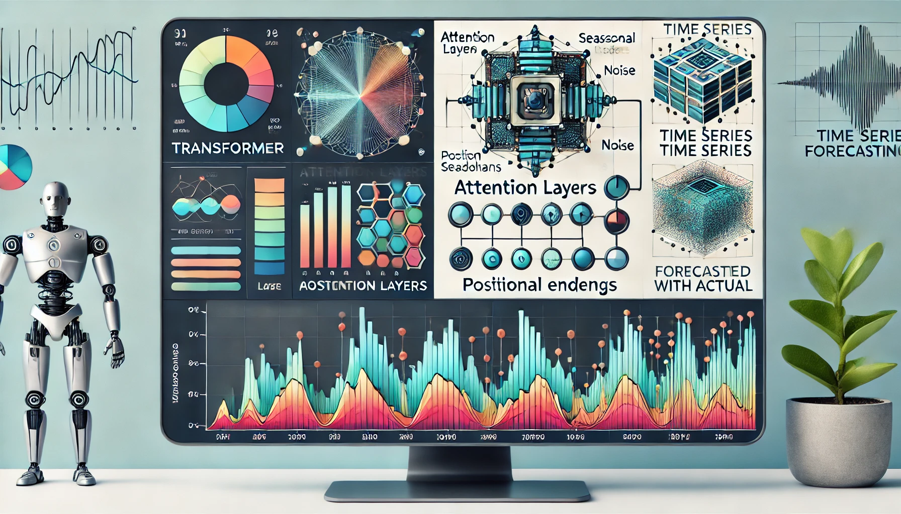

## Time series forecasting in Transformer model:
### What is Transformer:
The **Transformer model** is a deep learning architecture introduced in the paper *"Attention Is All You Need"* by Vaswani et al. in 2017. It was designed to address limitations of sequential models like RNNs and LSTMs, especially in tasks involving long-range dependencies and large datasets, such as natural language processing (NLP).

The key components of the Transformer model are:
1. **Self-Attention Mechanism**: This allows the model to focus on different parts of the input sequence, making it highly efficient in handling long-range dependencies.
2. **Positional Encoding**: Since the Transformer doesn't process sequences in order, it uses positional encodings to capture the position of each word in the sequence.
3. **Encoder-Decoder Architecture**: The model consists of two parts:
   - **Encoder**: Processes the input sequence and encodes it into a representation.
   - **Decoder**: Uses this representation to generate the output sequence.
4. **Multi-Head Attention**: This enables the model to focus on different parts of the input sequence simultaneously, improving performance.

Transformers are widely used in tasks like language translation, text generation, and more, and are the foundation of models like **BERT**, **GPT**, and **T5**.

### Time series forecasting task: 
Traditional methods like ARIMA or simple regression models struggle to capture complex patterns, long-term dependencies, or multiple interacting factors. In contrast, transformer models—originally designed for natural language processing tasks—have proven highly effective for time series forecasting due to their ability to handle such complexities.

Transformers allowing for better handling of complex dependencies, scalability, and multi-step predictions. Their ability to deal with large datasets, identify intricate patterns, and make highly accurate forecasts makes them an ideal choice for many real-world forecasting applications.

## Using `torch` in R to Build a Transformer Model

The **`torch`** package in R is an interface to PyTorch, a deep learning framework, and it provides tools for building, training, and evaluating neural networks, including Transformers.

To use `torch` in R for building a Transformer model, follow these steps:

**Install `torch` in R**:
First, you need to install the `torch` package. You can do so via CRAN or directly from GitHub:
```r
install.packages("torch")
library(torch)
```
The `torch` package in R offers flexibility to customize and build complex architectures like the Transformer for a variety of tasks, especially in NLP, and integrates well with other R-based machine learning tools.



